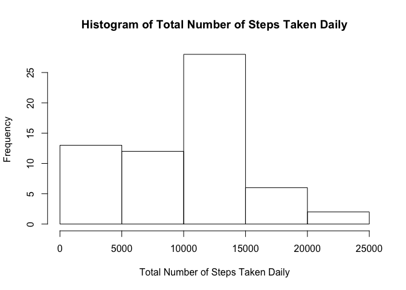
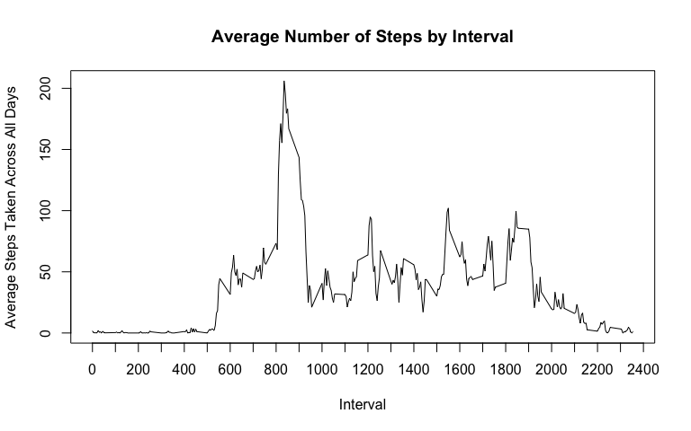
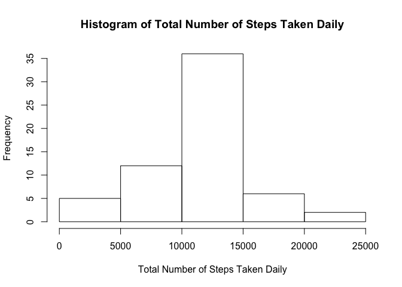
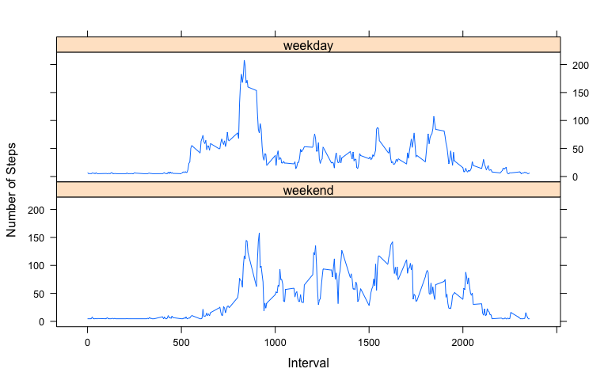

# Reproducible Research: Peer Assessment 1

## Loading and preprocessing the data
Reading source data activity.csv and convert steps column into numeric for analysis.

```r
activity <- read.csv("activity.csv", sep = ",")
activity$steps <- as.numeric(activity$steps)
activity$date <- as.Date(activity$date, format = "%Y-%m-%d")
```

## What is mean total number of steps taken per day?
Aggregate by summing the number of steps per day. Ignoring NA values.

```r
totaldata <- aggregate(activity$steps, by = list(activity$date), FUN = sum, na.rm = TRUE)
names(totaldata) <- c("date", "steps")
```

Plot the histogram of daily total steps taken.

```r
hist(totaldata$steps, main = "Histogram of Total Number of Steps Taken Daily", 
     xlab = "Total Number of Steps Taken Daily")
```

<!-- -->


```r
totalmean <- as.integer(mean(totaldata$steps))
totalmedian <- as.integer(median(totaldata$steps))
```
The mean and median of the total number of steps taken per day are 9354 and 
10395 respectively.

## What is the average daily activity pattern?
Calculating the average of the number of steps across days by interval. Ignoring NA values.

```r
intervaldata <- aggregate(activity$steps, by = list(activity$interval), FUN = mean, na.rm = TRUE)
names(intervaldata) <- c("interval", "steps")
```

Plot the line graph to show the interval with highest average number of steps across all days.

```r
plot(intervaldata$interval, intervaldata$steps, type = "l", xaxt = "n",
     xlab = "Interval", ylab = "Average Steps Taken Across All Days", 
     main = "Average Number of Steps by Interval")
axis(side=1, at=c(seq(from=0,to=2400,by=100)))
```

<!-- -->


```r
maxinterval <- intervaldata[intervaldata$steps==max(intervaldata$steps),]$interval
maxsteps <- round(max(intervaldata$steps), 2)
```
835 is the 5-minute interval, on average across all the days in the dataset, 
that contains the maximum number of steps of 206.17.

## Imputing missing values

```r
narows <- nrow(activity[is.na(activity$steps),])
```
There are 2304 rows with NA values from activity.csv.

Create a new dataset and replace NA values with the average steps by interval across all days.

```r
adjusteddata <- activity
adjusteddata[is.na(adjusteddata)] <- mean(intervaldata$steps)
```

Aggregate by summing the number of steps per day using adjusted data.

```r
adjustedtotaldata <- aggregate(adjusteddata$steps, by = list(adjusteddata$date), 
                               FUN = sum, na.rm = TRUE)
names(adjustedtotaldata) <- c("date", "steps")
```

Plot the histogram of daily total steps taken using the adjusted data.

```r
hist(adjustedtotaldata$steps, main = "Histogram of Total Number of Steps Taken Daily", 
     xlab = "Total Number of Steps Taken Daily")
```

<!-- -->


```r
adjustedmean <- as.integer(mean(adjustedtotaldata$steps))
adjustedmedian <- as.integer(median(adjustedtotaldata$steps))
```
The mean and median of the total number of steps taken per day are 10766 and 
10766 respectively for the adjusted data. This is different from the
unadjusted data (ignoring NA).

## Are there differences in activity patterns between weekdays and weekends?
Creating a additional field indicating whether date is a weekend or weekday in the
adjusted data.

```r
listweekday <- c('Monday', 'Tuesday', 'Wednesday', 'Thursday', 'Friday')
adjusteddata$weekday <- factor((weekdays(adjusteddata$date) %in% listweekday), 
                               levels=c(FALSE, TRUE), labels=c('weekend', 'weekday'))
```

Calculating the average of the number of steps across days by interval. Ignoring NA values.

```r
weekdata <- aggregate(adjusteddata$steps, 
                      by = list(adjusteddata$weekday, adjusteddata$interval), 
                      FUN = mean, na.rm = TRUE)
names(weekdata) <- c("weekday", "interval", "steps")
```

Plot the line graph comparing the average number of steps between weekday and weekend.

```r
library(lattice)
xyplot(steps~interval | factor(weekday), data = weekdata, xlab = "Interval", 
       ylab = "Number of Steps", layout = c(1,2), type = "l")
```

<!-- -->
